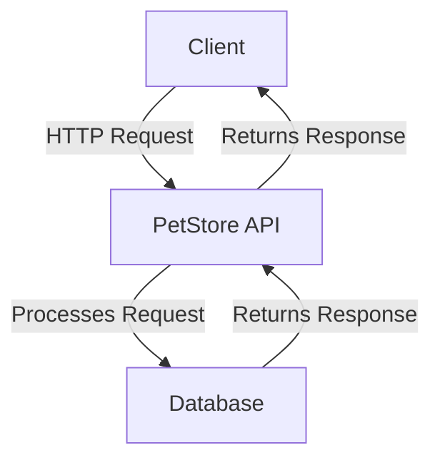
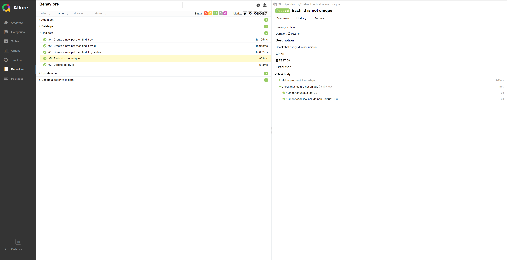
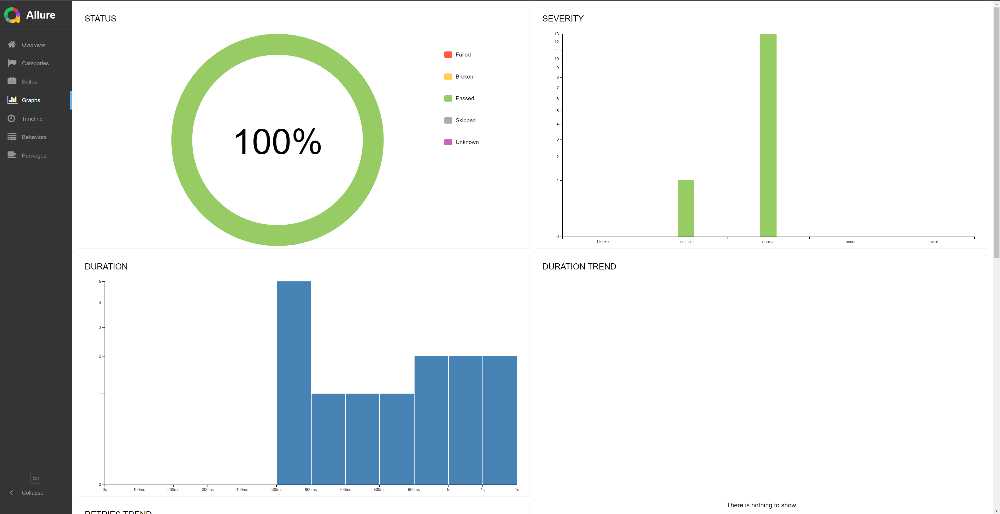
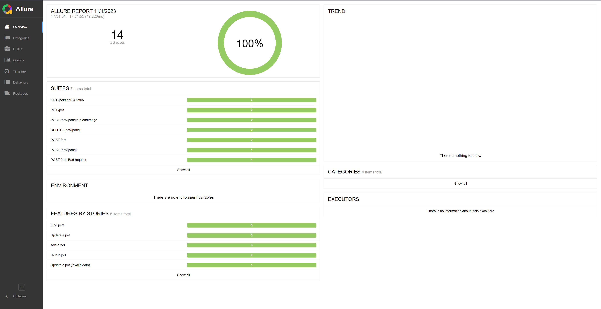

# ilink_petstore_swagger

Проект по автотестам на petstore-swagger

## Оглавление

- [Описание](#description)
- [Диаграмма](#diagram)
- [Тесты](#tests)
- [Пример отчетов Allure Report](#allureReport)


---

## Описание
<a id="description"></a>
В ходе тестирования были проверены следующие методы:

1. **POST /pet/{petId}/uploadImage**  
   Этот метод позволяет загружать изображение для конкретного питомца по его уникальному идентификатору.

2. **POST /pet - Add a new pet to the store**  
   Данный метод предназначен для добавления нового питомца в магазин.

3. **PUT /pet - Update an existing pet**  
   Метод позволяет обновить информацию о существующем питомце.

4. **GET /pet/findByStatus - find pets by status**  
   Этот метод осуществляет поиск питомцев в магазине по их текущему статусу.

5. **GET /pet/{petId}**  
   Позволяет получить информацию о конкретном питомце, используя его уникальный идентификатор.

6. **POST /pet/{petId} - Updates a pet in the store with form data**  
   Метод предназначен для обновления информации о питомце с использованием данных формы.

7. **DELETE /pet/{petId} - Deletes a pet**  

<a id="tools"></a>
### Технологии и инструменты

| JavaScript | Jest | Allure | Jasmine 2 |
| ---------- | ---- | ------ | -------- |
| <a href="https://www.javascript.com/"></a> | <a href="https://jestjs.io/"></a> | <a href="https://github.com/allure-framework"></a> | <a href="https://jasmine.github.io/" align="center"></a> |


## Диаграмма
<a id="diagram"></a>
Диаграмма взаимодействия с petstore.swagger


## Тесты
<a id="tests"></a>
----
Тестовые данные: объект - "зверек" содержит в себе заполненные поля для дальнейших проверок.


```javascript
const newPet = {
  id: 190000,
  category: {
    id: 0,
    name: "string",
  },
  name: "doggie",
  photoUrls: [""],
  tags: [
    {
      id: 0,
      name: "string",
    },
  ],
  status: "available",
};
```
### 1. POST /pet

- **check added pet's name**  
  Проверка добавления нового питомца в магазин и проверка соответствия имени питомца.

- **pet's id should be typeof 'number'**  
  Проверка, что идентификатор питомца имеет тип 'number'.

### 2. POST /pet: Bad request

- **status should be 500**  
  Проверка ответа на некорректный запрос (например, отправка строкового значения вместо числа в поле 'id').

### 3. DELETE /pet/{petId}

- **Delete pet by id check**  
  Проверка удаления питомца по идентификатору.

- **Delete pet with bad id**  
  Проверка попытки удаления питомца с некорректным идентификатором.

### 4. GET /pet/findByStatus

- **Create a new pet then find it by status**  
  Создание нового питомца и поиск его по статусу.

- **Create a new pet then find it by id**  
  Создание нового питомца и поиск его по идентификатору.

- **Create a new pet then find it by**  
  Проверка ответа при поиске по некорректному идентификатору.

- **Each id is not unique**  
  Проверка, что каждый идентификатор не является уникальным.

### 5. PUT /pet

- **check added pet's name**  
  Проверка обновления имени питомца.

- **attempt to update with invalid data**  
  Попытка обновления питомца с некорректными данными.

### 6. POST /pet/{petId}

- **Update pet by id**  
  Проверка обновления информации о питомце по идентификатору.

### 7. POST /pet/{petId}/uploadImage

- **upload an image**  
  Проверка загрузки изображения для питомца.

- **upload an image with badid**  
  Попытка загрузки изображения для питомца с некорректным идентификатором.

## AllureReport
<a id="allureReport"></a>
### Тест-кейс

### Графики

### Дэшборд

